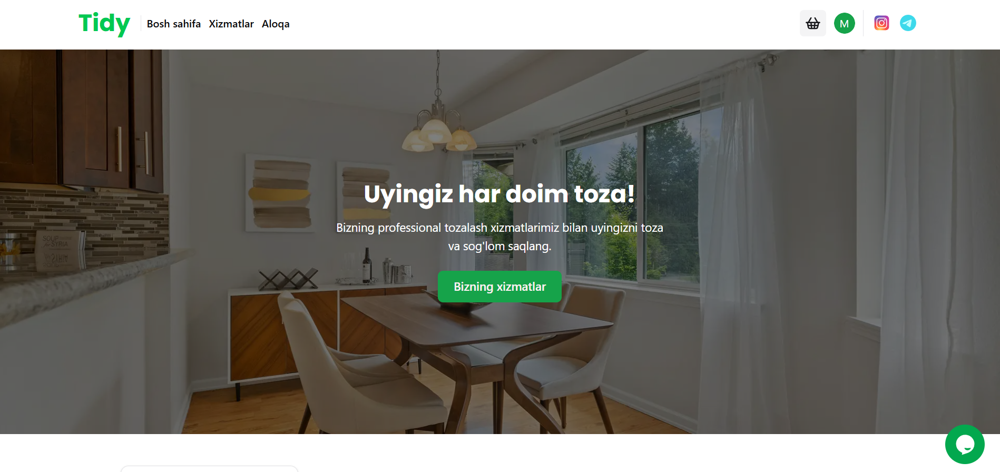
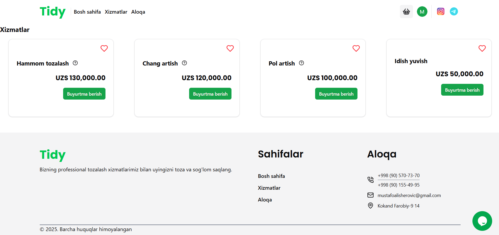
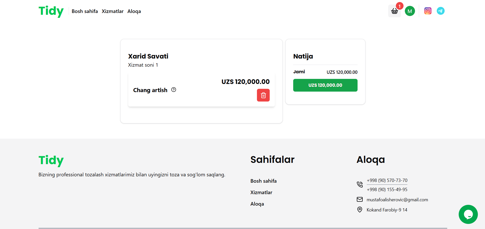
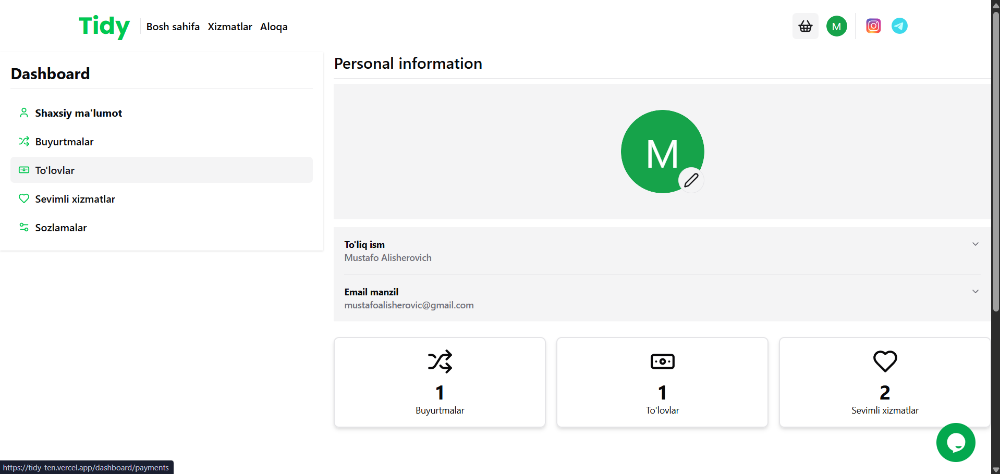
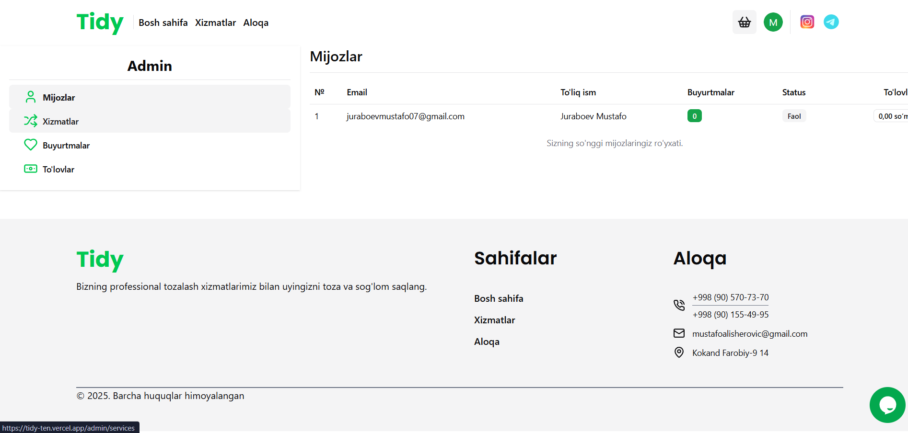

# 🧼 Home Cleaning Services Website

A modern web application for booking home cleaning services. Built with **Next.js**, **Hygraph**, and **NextAuth.

## 🌟 Features

### 👤 For Users:
- 🔐 Register and login via **email**
- 🧹 Choose from various **home cleaning services**
- 💖 Add services to **favorites**
- 🛒 Add multiple services to the **cart**
- 📅 Book services with preferred **date and time**
- 💳 View **payment history**
- 📦 Track **order history**

### 🛠️ For Admins:
- 👥 View and manage **users**
- 📦 View all **orders**
- 💰 Access full **payment history**
- ➕ Add/edit/remove **services**

## 🚀 Tech Stack

- ⚛️ Next.js
- 💅 Tailwind CSS
- 💬 Hygraph (GraphQL CMS)
- 🔥 Next-Auth Authentication

## 🖼️ Demo

Live preview: [tidy-ten.vercek.app](https://tidy-ten.vercel.app/)

## 🖼️ Screenshots

### 🏠 Home Page


### 🧹 Services Page


### 🛒 Cart Page


### 📦 Dashboard


### 🛠️ Admin Panel



## ⚙️ Getting Started

```bash
git clone https://github.com/your-username/cleaning-services.git
cd cleaning-services
npm install
npm run dev

🤝 Contributing
Pull requests are welcome! For major changes, open an issue first to discuss what you’d like to change.

📄 License
MIT © 2025 [Mustafo_Alisherovich]
